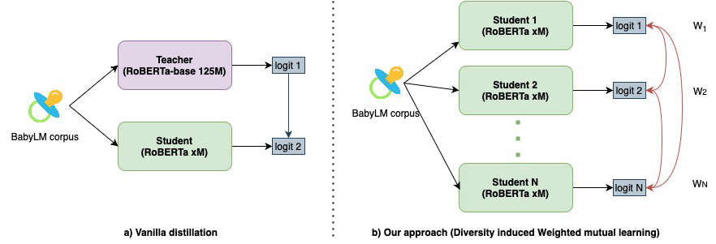

<h2 align="center"><b><h3>When Babies Teach Babies: Can student knowledge sharing outperform Teacher-Guided Distillation on small datasets?</h3></b></h2><br>


<p align="center">
  <b>Srikrishna Iyer</b>
</p>

<p align="center">
  <i>
    AI.DA STC, Group Technology Office<br>
    ST Engineering<br>
  </i>
</p>
<br>

<p align="center">
  <a href="https://drive.google.com/file/d/1RD2IQJ-0Y0NmtC-wzxn_CW1jpM9rQjdp/view?usp=sharing"><b>Paper</b></a><br>
  <a href="https://huggingface.co/AI-DA-STC"><b>HuggingFace models</b></a>
</p>

<p align="center">
    
</p>

_______

<br>

This is the official repository for our paper about pre-training sample-efficient language models on a representative 10M and 100M text corpus. Our method builds upon deep mutual learning, introducing a student model search for diverse initialization. We address the limitation of treating students equally by formulating weighted mutual learning as a bi-level optimization problem. The inner loop learns compact students through online distillation, while the outer loop optimizes weights for better knowledge distillation from diverse students. This dynamic weighting strategy eliminates the need for a teacher model, reducing computational requirements. Our evaluations show that teacherless methods can match or surpass teacher-supervised
approaches.

_______

## Setup

**Virtual Environment manager** <br>
This project uses mamba as the package and virtual environment manager. To install mamba, here are some quick steps to doing so:

For macOS/Linux : 
```bash
$ curl -L -O "https://github.com/conda-forge/miniforge/releases/latest/download/Miniforge3-$(uname)-$(uname -m).sh" 

$ bash Miniforge3-$(uname)-$(uname -m).sh
```

For Windows :<br>
refer [here](https://github.com/conda-forge/miniforge?tab=readme-ov-file#windows)

**Create environment and install dependencies**

For macOS (Apple Chip):
```bash
$ mamba env create -f dependencies/babylm-conda-metal.yaml
```

For Linux :
```bash
$ mamba env create -f dependencies/babylm-conda.yaml
```

**Download data**

[Click here to download dataset](https://osf.io/ad7qg/) and save the dev, text, train_10M and train_100M to the `data/raw` folder

## Data pre-processing

Assuming you're already on root folder

Run preprocessing shell script:
```
$ bash ./scripts/preprocess.sh
```
This should create and save preprocesed training, test and dev babylm datasets a folder under data called ```preprocessed```. 

## Configure

Configure the following config parameters in conf/config.yaml : 

| Config Param | Values | Description |
|--------------|--------|-------------|
| general.exp_name | Any | Name of the experiment where trained tokenizers, model configs, trained model checkpoints will be saved |
| general.wandb_log | True/False | Flag to enable/disable wandb logging |
| general.wandb_project | Any | Name of wandb project where the training metrics will be logged |
| general.wandb_run_name | Any | Name of wandb run within the project. Datetime will be appended to this to ensure uniqueness |
| preprocess.tokenizer_type | from_scratch/pretrained/pretrained_hf | Whether to train a tokenizer from scratch or use pretrained one |
| preprocess.train_data_path | Any | Path to preprocessed training data with .train extension |
| preprocess.dev_data_path | Any | Path to preprocessed dev data with .dev extension |
| WML.distillation_method | mutual/vanilla | Select either mutual (without teacher) or vanilla (with teacher supervision) distillation |
| WML.hf_model_name | Any | Name of huggingface model used as teacher model when distillation_method = vanilla | 
| WML.use_opt_config | True/False | This enable/disables architecture search to find peer models. If you have already configs saved in models/exp_name/dataset_name/arch_search_results, then you can set to False |
| WML.model_type | MLM/CLM | MLM (Masked language models eg. RoBERTa) or CLM (Causal language models eg. GPT2) |
| WML.num_peers | 1/2/4 | Works best for num_peer = 4 | 

**Train custom tokenizer**
```
$ python scripts/run_tokenizer.py
```

**Run Weighted deep mutual learning (WDML) training script for num_peers = 4**
```
$ python scripts/train_WML.py
```

## Please cite the following publication 

```coming soon```
